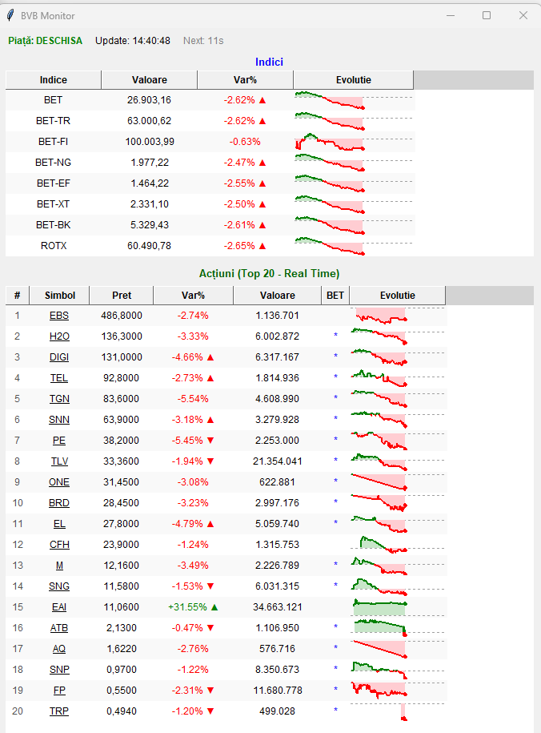

# BVB Monitor



Aceasta este o aplicație asistent / widget desktop pentru monitorizarea bursei de valori (BVB) din România. Ea extrage și afișează intraday cele mai recente prețuri, variații și grafice tip „sparkline” ale celor mai tranzacționate acțiuni, plus informații despre principalii indici bursieri (inclusiv evidențierea companiilor din componența indicelui BET).

## Caracteristici
- Extrage prețurile de piață și calculează automat variațiile intraday.
- Evidențiază prin culoare și un „*” acțiunile care fac parte din indicele principal BET (componentele sunt extrase dinamic).
- Afișează grafice „sparkline” pentru evoluția prețurilor în ziua curentă, inclusiv un tooltip cu detalii orare ale prețului și variației.
- Fiecare simbol din tabel permite deschiderea directă în browser a detaliilor aferente de pe site-ul BVB, printr-un simplu click pe el.

## Cerințe
- Python 3
- Conexiune la Internet

## Instalare

1. Asigură-te că ai instalat Python: [https://www.python.org/downloads/](https://www.python.org/downloads/)
2. Clonează repository-ul local și accesează folderul:
   ```bash
   git clone https://github.com/RacMailRO/bvbMonitor.git
   cd bvbMonitor
   ```
3. Instalează pachetele necesare rulând:
   ```bash
   pip install pandas requests
   ```
   *Notă: pachetul `tkinter` este responsabil de interfața grafică desktop; acesta e inclus automat în versiunile de Python din Windows.*

## Utilizare

Pentru a lansa aplicația, dă dublu click pe `bvb.py` sau deschide un terminal (CMD/PowerShell) și rulează:
```bash
python bvb.py
```

Datele descărcate intraday sunt salvate și pot fi consultate sau șterse la nevoie în fișiere de forma `.json` în folderul intern `data`.
