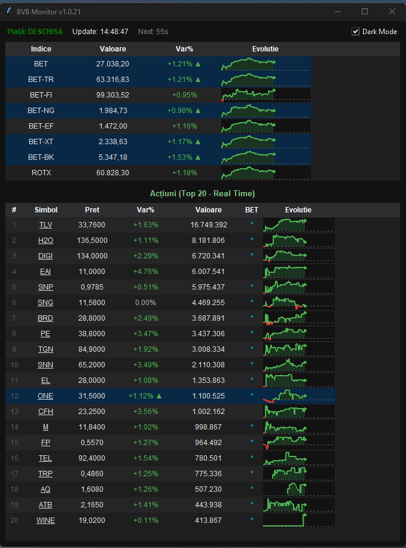

# BVB Monitor




Aceasta este o aplicație asistent / widget desktop pentru monitorizarea bursei de valori (BVB) din România. Ea extrage și afișează intraday cele mai recente prețuri, variații și grafice tip „sparkline” ale celor mai tranzacționate acțiuni, plus informații despre principalii indici bursieri (inclusiv evidențierea companiilor din componența indicelui BET).

## Caracteristici
- **Mod Întunecat (Dark Mode)**: Comutare manuală între teme (Dark/Light) și detecție automată a temei Windows, inclusiv bara de titlu neagră pentru un aspect premium.
- **Animații Fluide**: Evidențierea rândurilor actualizate cu un efect de „solid-hold” urmat de un „fade” lin (estompare treptată).
- **Tooltip Plutitor Inteligent**: Graficele din tabel și fereastra de detalii oferă informații precise prin tooltips care urmăresc cursorul mouse-ului.
- **Grafic Detaliat**: Click pe graficul unui simbol pentru a deschide o fereastră mare cu evoluția intraday completă, crosshair și detalii exacte.
- **Integrare BVB**: Evidențiază componentele indicelui BET (cu „*”) și oferă link-uri directe către site-ul BVB pentru fiecare simbol.
- **Acuratețe**: Extrage prețurile în timp real și calculează variațiile intraday față de prețul de referință.

## Cerințe
- Python 3
- Conexiune la Internet

## Instalare

1. Asigură-te că ai instalat Python: [https://www.python.org/downloads/](https://www.python.org/downloads/)
2. Clonează repository-ul local și accesează folderul:
   ```bash
   git clone https://github.com/RacMailRO/bvbMonitor.git
   cd bvbMonitor
   ```
3. Instalează pachetele necesare rulând:
   ```bash
   pip install pandas requests
   ```
   *Notă: pachetul `tkinter` este responsabil de interfața grafică desktop; acesta e inclus automat în versiunile de Python din Windows.*

## Utilizare

Pentru a lansa aplicația, dă dublu click pe `bvb.py` sau deschide un terminal (CMD/PowerShell) și rulează:
```bash
python bvb.py
```

Datele descărcate intraday sunt salvate și pot fi consultate sau șterse la nevoie în fișiere de forma `.json` în folderul intern `data`.
